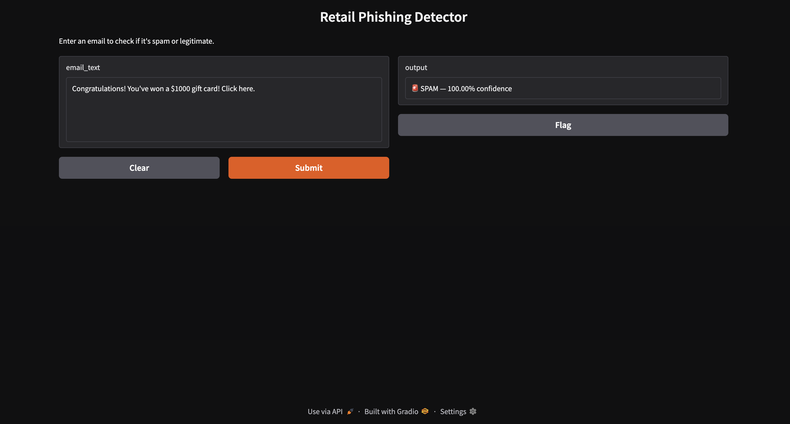

# 🛡️ AI-Based Phishing Detection for Retail

A spam classifier built with Python and Scikit-Learn to detect phishing emails 
in a retail context. Uses Bag of Words vectorization and a Naive Bayes classifier.

---

## 📌 Project Overview
Phishing detection is a classification problem. This project trains a Naive Bayes 
model on a public Spam vs Ham dataset to filter suspicious retail emails, 
then tests it against real-world phishing scenarios.

---

## 🎯 Objective
Train a spam classifier for retail using Python and Scikit-Learn to filter emails 
and detect phishing attempts.

---

## 🛠️ Technologies Used
- Python
- Scikit-Learn
- Pandas
- Matplotlib
- Gradio (GUI)
- Jupyter Notebook

---

## 📊 Results
- **Model Accuracy:** 98.16%
- **Spam Precision:** 94%
- **Spam Recall:** 92%

## 🖥️ GUI
This project includes an interactive GUI built with Gradio that allows users to 
paste any email and instantly check if it is spam or legitimate.

### Features
- Paste any email text into the input box
- Get instant SPAM/HAM prediction
- See confidence percentage
- Flag incorrect predictions for future model improvement
---

## 📁 Dataset
Download the dataset from Kaggle:
https://www.kaggle.com/datasets/bagavathypriya/spam-ham-dataset

Place it in the `data/` folder and rename it to `spamhamdata.csv`

---

## 🚀 How to Run
1. Clone the repository
2. Install dependencies:
pip install -r requirements.txt

3. Place `spamhamdata.csv` inside the `data/` folder
4. Open `Phishing_Detection_NB.ipynb` in Jupyter Notebook
5. Run all cells

---

## 📂 Project Structure
phishingdetection/
├── Phishing_Detection_NB.ipynb  # Main notebook
├── confusion_matrix.png          # Model evaluation plot
├── gui_screenshot.png            # GUI screenshot  
├── requirements.txt              # Dependencies
└── data/
    └── spamhamdata.csv           # Dataset (download from Kaggle)
---

## ⚠️ Limitations
- Model may flag legitimate emails containing words like "verify" or "click"
- Does not detect gibberish or unicode-based phishing tricks
- Based on Bag of Words — no semantic understanding

---

## 🔮 Further Development
- Upgrade to TF-IDF vectorization
- Try SVM or deep learning models
- Deploy as a web app

---

## 📜 License
MIT
